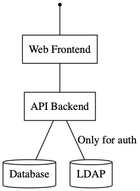
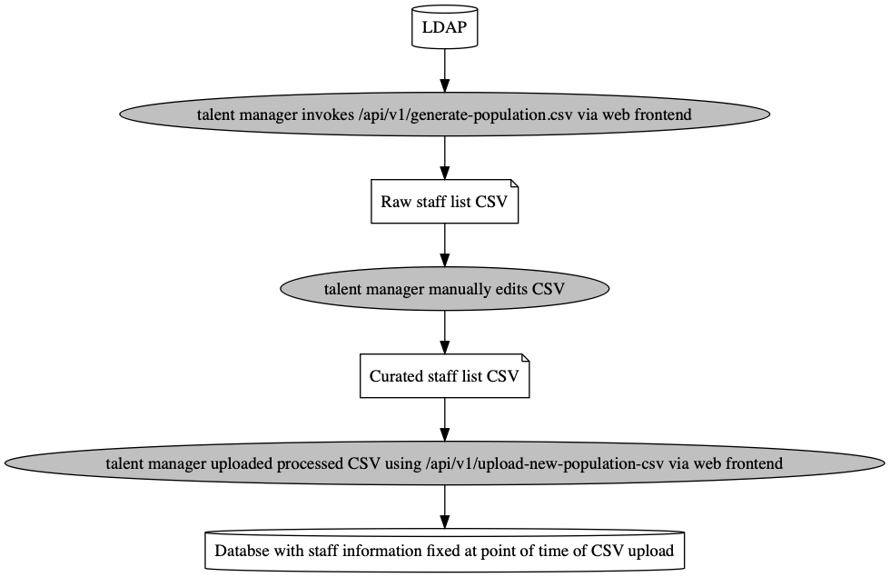

# `Adaero` - A simple peer-to-peer feedback platform

Talent management is extremely important to us at Man Group. We do our best to nurture our employees’ development at every opportunity. Receiving feedback is a crucial part of gaining the self-awareness necessary to direct our careers toward our aspirations.

Getting meaningful feedback can be difficult: colleagues can feel uncomfortable delivering necessary but unwelcome truths, collecting feedback from multiple parts of the business can be onerous, and analysing the resultant data is not straightforward. Adaero, [Latin for “Appraise”], enables employees to anonymously enter feedback about their colleagues as part of an initiative to improve an organisations feedback culture.

We found that off-the-shelf tools weren’t cutting it, and so we built our own solution - and as active contributors to the open source community have made it openly available for use by others. 

* Read our [tech blog](https://www.man.com/what-do-your-colleagues-really-think-of-you) for further details on what we've achieved with this tool and why we made the design decision we did. 
* HR or Talent Professionals looking for further details on how the tool works should read our [User Guide](https://www.man.com/man-feedback-app-tool-guide)

[](https://circleci.com/gh/manahl/feedback_tool)

`feedback_tool` is a platform for managing peer-to-peer feedback within an 
organisation.

## Docker Quickstart

1. Build and Run the application on local Docker
```
cd frontend
docker build -t feedback-tool-dev-frontend . 
cd ..
docker build -t feedback-tool-webapp . 
cd docker/dev
docker-compose up -d
```

2. Setup a dummy template, 3 question and period data to carry out a feedback cycle.
```
cd ../..
python setup.py develop
pip install faker freezegun webtest mock 
python tests/scripts/configure_db.py --config host_example.ini add-test-periods
```

3. Once fully started, open http://localhost:4200. Refer to `docker/shared/ldif/01-data.ldif` 
for credentials for dummy users. Use the following commands to change phases.

```
python tests/scripts/configure_db.py --config host_example.ini --subperiod enrollment adjust
python tests/scripts/configure_db.py --config host_example.ini --subperiod entry adjust
python tests/scripts/configure_db.py --config host_example.ini --subperiod approval adjust
python tests/scripts/configure_db.py --config host_example.ini --subperiod review adjust
```


## Configuration values

#### `feedback_tool.db_url`
Follow http://docs.sqlalchemy.org/en/latest/core/engines.html#database-urls

#### `feedback_tool.business_unit`
Displayed in the frontend beside the logo. Useful for multi-tenant setups 
within larger companies.

#### `feedback_tool.displayed_hostname`
If set, this will override the use of `/etc/hostname` as the hostname 
displayed in emails to the set string.

#### `feedback_tool.enable_send_email`
If set to `true`, it will cause emails to be sent. This happens:

* When a talent manager uses the management panel to manually send them
* Automatically according to the email schedule if 
  `feedback_tool.run_email_interval_job` config value is set to `true`

#### `feedback_tool.production_hostname` and `feedback_tool.production_user`
If these values match the what the application sees on the host, then
this will enable:

* Loading of all user emails for the given business unit unless
  `feedback_tool.load_user_email_list` is set, which then will only
  load the subset of the user emails in the list.

<a name="homebase-location">

#### `feedback_tool.homebase_location`
The datetimes set in the Period table are technically not UTC. Those times 
are coupled with this configured value, the location. The phase shift will 
occur when a particular datetime is passed at this configured location.

Here are the available choices:
* London
* New York
* Oxford
* Shanghai
* Hong Kong
* GBR
* Boston
* Pfäffikon


#### `feedback_tool.talent_manager_usernames`
Set this to an array of strings containing the LDAP usernames
of who you would like to be able to login with the talent manager role.
e.g. ["lcarty", "chasmith"]

#### `feedback_tool.reload_users_on_app_start`
This is normally set to `False` as we now rely on talent managers uploading 
the user hierarchy configuration CSV into the application.

#### `feedback_tool.load_user_email_list`
In non-prod environments, we don't save emails within the User database.
If this is set, we will save the emails of the following list of users
identified by their LDAP username, allowing them to be emailed
(if emailing is turned on).
e.g. ["chasmith"]

#### `feedback_tool.allow_passwordless_access`
A useful development flag for impersonation. This should be set to
`false` in production.

#### `feedback_tool.run_email_interval_job`
If `true`, run a job in the background that checks the email flags for
the current period and if not set, send out the relevant emails and set.


#### `feedback_tool.display_name`
Normally the company name, that will be displayed in the frontend.

#### `feedback_tool.support_email`
Email that will be displayed to users when they are denied access to the tool 
or there is an unexpected error.

#### `feedback_tool.reply_email`
Email that will be displayed to users that they receive from the automated 
notification system (notifications sent by email).

#### `feedback_tool.login_username_msg`
Help message for the login input to remind users what username to use.

#### `feedback_tool.login_password_msg`
Help message for the login input to remind users what password to use.

#### `feedback_tool.tm_upload_new_population_msg`
Help message for talent manager on how to populate the CSV that is to be 
uploaded.

#### `feedback_tool.tm_generate_population_msg`
Help message for talent manager on how to generate the population CSV.

#### `feedback_tool.ldap_uri`
URI to LDAP instnace

#### `feedback_tool.ldap_username_key`
LDAP field name for what to bind to the `username` User model variable. 

#### `feedback_tool.ldap_user_bind_template`
Template used to generate the bind DN for a user. Refer to the example config.

#### `feedback_tool.ldap_manager_key`
LDAP field name for what to bind to the `manager` User variable. 

#### `feedback_tool.ldap_location_key`
LDAP field name for what to bind to the `location` User variable. 

#### `feedback_tool.ldap_uid_key`
LDAP field name for what to bind to the `uid` User variable. 

#### `feedback_tool.ldap_department_key`
LDAP field name for what to bind to the `department` User variable. 

#### `feedback_tool.ldap_business_unit_key`
LDAP field name for what to bind to the `business_unit` User variable. 

#### `feedback_tool.ldap_search_bind_dn`
Bind DN which should have permissions to search for users.

#### `feedback_tool.ldap_search_password`
Password for the search bind DN.

#### `feedback_tool.ldap_base_dn`
Base DN to perform the user search upon.

#### `feedback_tool.ldap_dn_username_attribute`
Attribute that the username is assigned to in a DN

#### `feedback_tool.ldap_dn_username_regex`
Regex for extraction of a username from a DN

#### `feedback_tool.logo_filename`
If the file exists in the assets folder on the backend, serve this up to the frontend.

## Design
This section will explain how the application is designed in terms of strucutures and processes, and some reasons why it is done this way.

### Architecture


We use:
* Backend - Pyramid
* Frontend - Angular
* Database - Agnostic due to use of SQLAlchemy library

The choices of these were simply because this was a hard requirement to match the internal technology stack at inception of the project.

The backend is a just an API service that also serves the productionised HTML/CSS/JS Angular frontend plus other static assets such as images.

Refer to below for why LDAP is only used for authentication and NOT authorization.

#### Staff list generation process

The available users in the feedback tool are **statically generated and fixed until manually updated.** This is desired despite having active access to the LDAP server. The reason for this is that during a feedback cycle, we do not want to have users entering or leaving the feedback cycle unintentionally, which would happen if we used LDAP as a source of truth.

On top of this, the reporting structure in LDAP doesn't necessarily match the real world, and may change temporarily due to transient staff issues. Putting the power into the talent manager's hands makes dealing with such situations easier, without required developer intervention.

Therefore, the process as is follows:



The CSV lists the relationships between staff member, therefore marking who is a staff member and who is a 
manager. This information is used for authorization.

## Documentation

Graph source are in the `*.dot*` files. To regenerate graph PNGs.

1. Install graphviz
2. Run
   ```plain
   dot -Tpng architecture.dot -o architecture.png
   dot -Tpng population.dot -o population.png
   ```
